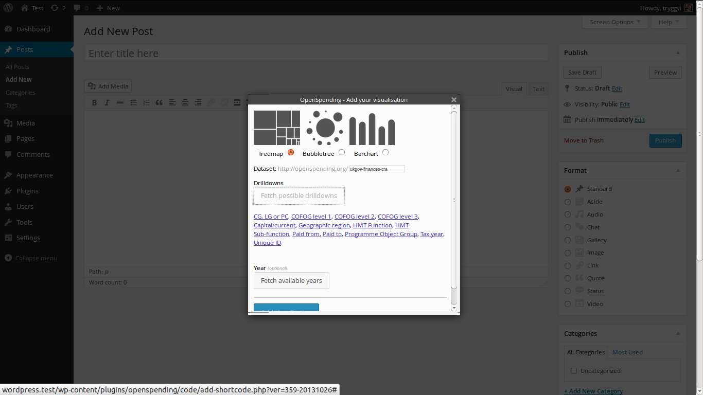
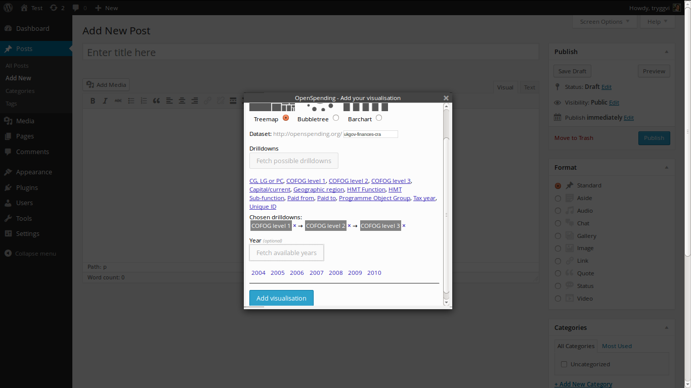
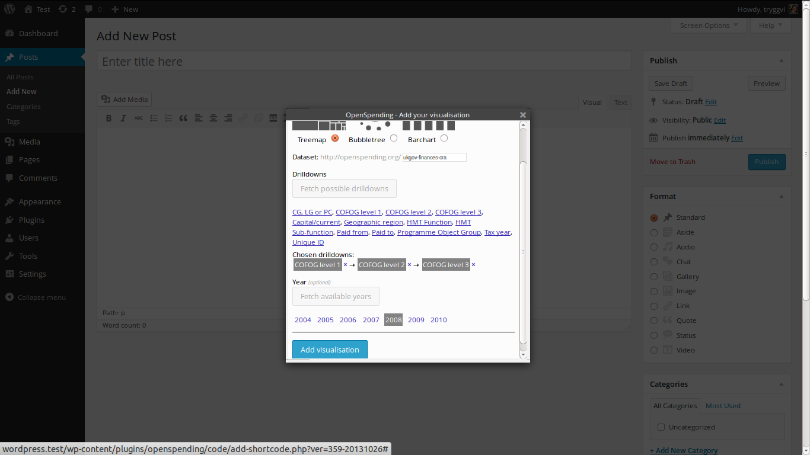
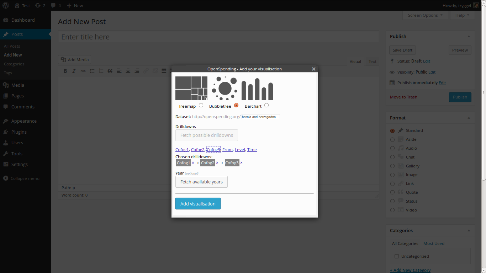

# Adding an OpenSpending visualisation via the editor

After installing the OpenSpending WordPress plugin a small button with an OS logo appears in the editor:

Click this button to add a visualisation. You will be prompted by a popup window from which you can type in the needed configurations for your visualisation:

## Treemap (full walkthrough of interface)

Choose your type of visualisation (treemap or bubbletree). Let's say you choose treemap. Now type in the identifier for your dataset. The identifier you can get from the OpenSpending url.

For example, if your dataset lives at http://openspending.org/ukgov-finances-cra you would type in ukgov-finances-cra as the dataset.

When you have filled in your dataset click on the button called *Fetch drilldowns*. This will get the available drilldown dimensions for you:

Now, click on the dimensions you want to drilldown into **in the order you want the drilldown to happen**. You will see the dimensions and the order below the list of available dimensions (as *Chosen dimensions*):

You can do the same thing if you want to only get data for a particular year. Looking at a year in your dataset is entirely **optional**.First you click on *Fetch available years*. This goes out and fetches the years for the dataset and presents them to you. 

You click on the year you want to look at. Note that you can only choose one year per visualisation (or no year which fetches data for all of the years).

After choosing your drilldown dimensions (and possibly the year) click *Add visualisations*. This will add the so-called *shortcode* to your blog post. The shortcode has the form:

    [openspending type="treemap" dataset="my-dataset" dimensions="from,to"]

If you selected a year, there will be *year="2013"* in there somewhere. This is what creates the visualisation on your page (so you can move that square bracket along with its content around the page if you want):

Now you can publish your page or post and have a look. You'll see your visualisation added exactly where you want it to be:

## Bubbletree (short walkthrough)

Alright, now if you want to create a bubbletree you do the same thing but choose bubbletree as a visualisation type:

Then fill in the dataset identifier as you do with the treemap and fetch the drilldowns. Here things get a bit more difficult.

If you want a beautiful bubbletree with icons and colors (instead of grey bubbles with no icons) you need to use Cofog and this **must** be present in the dataset and it **must** be a compound dimension (each level).

So when the dataset is created and modelled the there must be a compound dimension representing Cofog level 1. As a compound dimension it must map its *id* to the Cofog code, e.g. '09' for education, and the *label* must be the name of the category (e.g. 'The Environment' for id: 09).

So both the id and the label **must** be fields in the original data source. We also recommend that you de-jargonize the cofog standard. Use words normal people understand, e.g. 'Helping Others' instead of 'Social protection'.

You have to do the same for the other two levels of Cofog and the *id* must be the full Cofog code, e.g. '10.2' for the level 2 category 'Old age'.

If your dataset has already done this for all three Cofog levels (might be less but that's not as granular) you then fetch the drilldowns and choose the cofog levels in order:

Then you like described in the treemap tutorial you choose the year you want to look at and then add the visualisation. Just like with the treemap this will create a shortcode with all the essential information:

Now you can publish your page or post and have a look. A word of advice. The bubbletree changes the url for the rendering of levels and this can have unintended consequences. For example if there are two or more bubbletrees in a blog post or on a page they won't work (not in the list of blogs either). So take care when you use bubbletrees.

