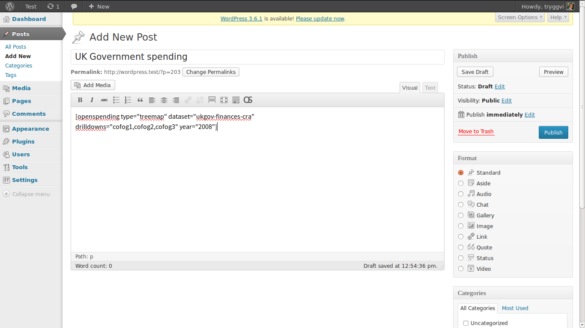

# Adding an OpenSpending visualisation via the editor

After installing the OpenSpending WordPress plugin a small button with an OS logo appears in the editor:

Click this button to add a visualisation. You will be prompted by a popup window from which you can type in the needed configurations for your visualisation:

Choose your type of visualisation (at the moment only the treemap is supported) and type in the identifier for your dataset. The identifier you can get from the OpenSpending url.

For example, if you're dataset lives at http://openspending.org/ukgov-finances-cra you would type in ukgov-finances-cra as the dataset.

When you have filled in your dataset click on the button called *Fetch drilldowns*. This will get the available drilldown dimensions for you:

Now, click on the dimensions you want to drilldown into **in the order you want the drilldown to happen**. You will see the dimensions and the order below the list of available dimensions (as *Chosen dimensions*):

You can do the same thing if you want to only get data for a particular year. Looking at a year in your dataset is entirely **optional**.First you click on *Fetch available years*. This goes out and fetches the years for the dataset and presents them to you. 

You click on the year you want to look at. Note that you can only choose one year per visualisation (or no year which fetches data for all of the years).

After choosing your drilldown dimensions (and possibly the year) click *Add visualisations*. This will add the so-called *shortcode* to your blog post. The shortcode has the form:

    [openspending type="treemap" dataset="my-dataset" dimensions="from,to"]

If you selected a year, there will be *year="2013"* in there somewhere. This is what creates the visualisation on your page (so you can move that square bracket along with its content around the page if you want):

Now you can publish your page or post and have a look. You'll see your visualisation added exactly where you want it to be:

